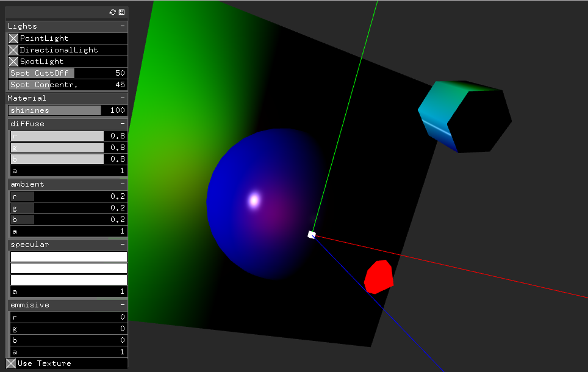

# Lighting shaders

Example with different types of lighting shading methods with materials and textures.

* Shaders were taken from:https://github.com/Scylardor/ofxShadersFX
* GLSL version: 330

## Gouraud shading
https://en.wikipedia.org/wiki/Gouraud_shading

* Per Vertex lighting calculation.

Gouraud shading, named after Henri Gouraud, is an **interpolation** method used in computer graphics to produce continuous shading of surfaces represented by polygon meshes. In practice, Gouraud shading is most often used to achieve continuous lighting on triangle surfaces by computing the lighting at the corners of each triangle and linearly interpolating the resulting colours for each pixel covered by the triangle. Gouraud first published the technique in 1971.

## Phong shading

* Per Fragment lighting calculation.

https://en.wikipedia.org/wiki/Phong_reflection_model
https://en.wikipedia.org/wiki/File:Phong_components_version_4.png

## Blinn Phong shading

* Per Fragment lighting calculation.

https://en.wikipedia.org/wiki/Blinn%E2%80%93Phong_shading_model

The Blinn–Phong reflection model (also called the modified Phong reflection model) is a modification to the Phong reflection model developed by Jim Blinn.[1]

Blinn–Phong is the default shading model used in OpenGL[2] and Direct3D's fixed-function pipeline (before Direct3D 10 and OpenGL 3.1), and is carried out on each vertex as it passes down the graphics pipeline; pixel values between vertices are interpolated by Gouraud shading by default, rather than the more computationally-expensive Phong shading.

