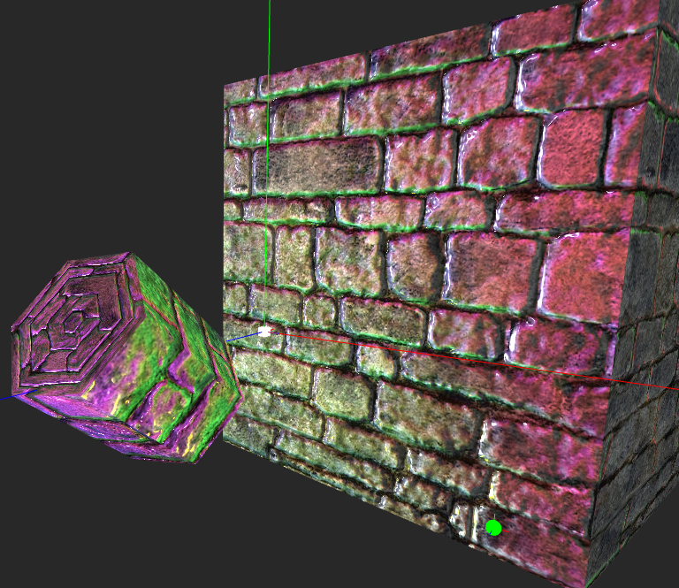

# Normal Mapping
#### Without precomputed tangent space vectors

In 3D computer graphics, normal mapping, or "Dot3 bump mapping", is a technique used for faking the lighting of bumps and dents – an implementation of bump mapping. It is used to add details without using more polygons. A common use of this technique is to greatly enhance the appearance and details of a low polygon model by generating a normal map from a high polygon model or height map.

Normal maps are commonly stored as regular RGB images where the RGB components correspond to the X, Y, and Z coordinates, respectively, of the surface normal. (https://en.wikipedia.org/wiki/Normal_mapping)

#### Sources:

- https://github.com/McNopper/OpenGL/tree/master/Example07

- http://www.geeks3d.com/20130122/normal-mapping-without-precomputed-tangent-space-vectors/

- http://www.thetenthplanet.de/archives/1180

