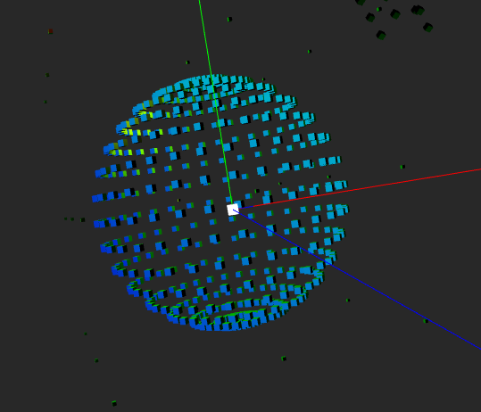
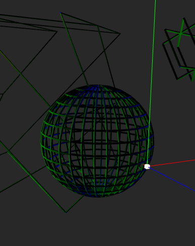

# Geometry Shaders

### Examples:

* Passthrough
* Duplicate geometry
* Cubes from points
* Rects from lines
* Normals drawing

#### Sources:

* https://github.com/McNopper/OpenGL/blob/master/Example10/

* http://learnopengl.com/#!Advanced-OpenGL/Geometry-Shader

* http://www.informit.com/articles/article.aspx?p=2120983&seqNum=2

* Procedural Primitives:
http://wiki.unity3d.com/index.php/ProceduralPrimitives#C.23_-_Box

