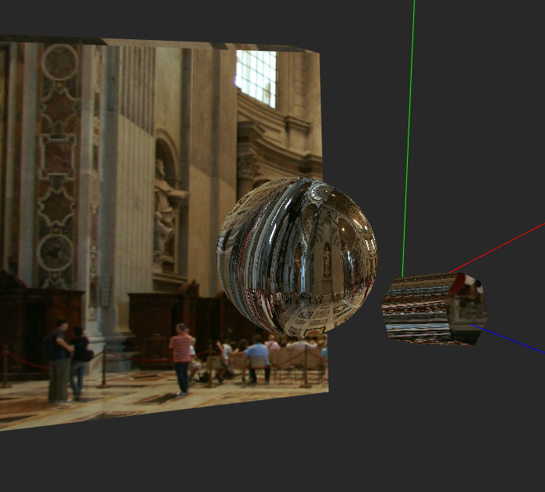
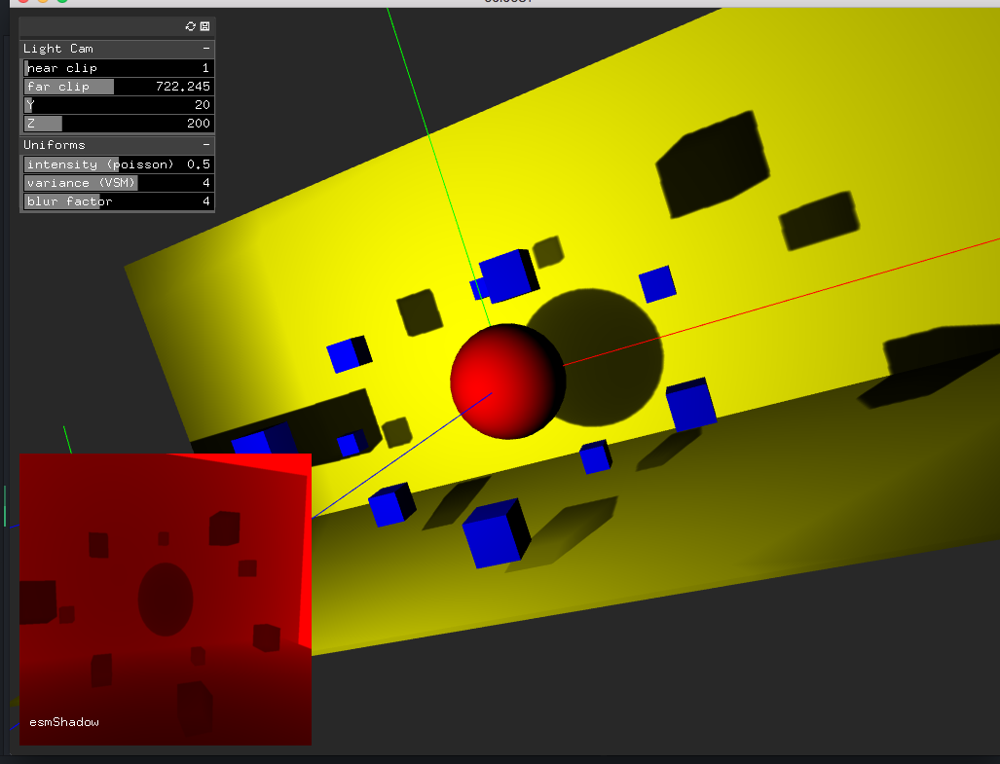

# Shaders Library

Collection of GLSL Shaders for OpenGL 3.2+ working with [openFrameworks](http://openframeworks.cc/).  

### Examples

* Phong Shading
* Normal Mapping
* Cube Mapping
* Displacement Mapping
* BRDF
* Geometry Shaders
* Tessellation shaders
* Shadow Mapping

### Sources and references

This library gathers different related examples, projects, tutorials, documentation, etc. All of them are referenced the *readme* file of each example.

### Compilation

* Xcode projects were developed with OF **0.9.3** and **Xcode 8.0**
* Clone this repository into OF_ROOT/apps/

